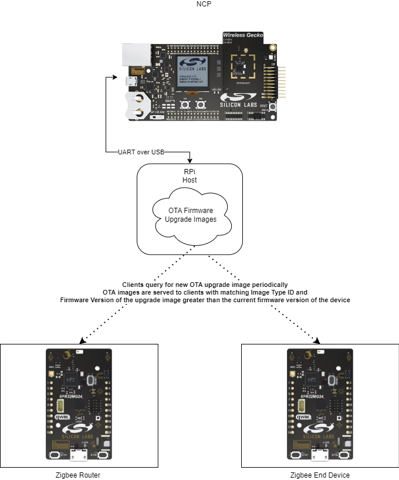
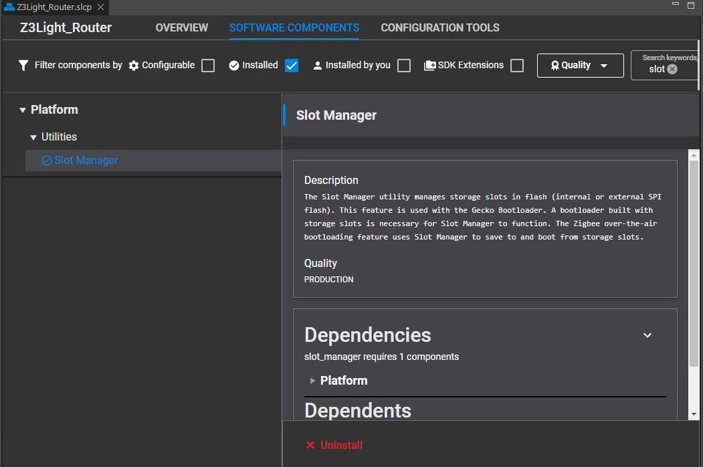

# Zigbee OTA #

## Summary ##

This project uses Silicon Lab boards to demonstrate the Over-The-Air (OTA) update functionality in a Zigbee network. The network used to demonstrate the OTA functionality includes a Gateway (Z3Gateway), a Router (Z3Light_Router), and an End Device (Z3Switch_SED). The Gateway performs the OTA Server role to store and serve the upgrade images to the OTA Clients, the Routers, and the End devices in the network. The OTA Clients periodically query for new applicable upgrade images from the OTA Server.

  

### References ###

- OTA Bootloader Server and Client Setup in Zigbee [(AN1384 Rev 0.2)](https://www.silabs.com/documents/public/application-notes/an1384-ota-bootloader-server-client-setup-zigbee-7.pdf)

- Simplicity Commander Reference Guide - For .ota image file creation from .gbl file [(UG162)](https://www.silabs.com/documents/public/user-guides/ug162-simplicity-commander-reference-guide.pdf)

## Gecko SDK Version ##

- Developed and tested on:
  - GSDK v4.3.2 [(release note)](https://www.silabs.com/documents/public/release-notes/gecko-platform-release-notes-4.3.2.0.pdf)
  - Zigbee Stack v7.3.2.0 [(release note)](https://www.silabs.com/documents/public/release-notes/emberznet-release-notes-7.3.2.0.pdf).

## Hardware Required ##

- **Zigbee Gateway (Host-NCP):**
  - **Raspberry Pi** 4 as Host with Raspbian GNU/Linux 12 (bookworm) or other versions of the OS (Recommendation)
  - Silicon Labs **xG21 BRD4180B** as **NCP** using **UART Connection**
- **Zigbee Router and End Device:**
  - Silicon Labs **xG24 BRD2601B** in **SoC** mode

## Connections Required ##

- Minimum Connections:
  - USB connection between the NCP (BRD4180B) and the Raspberry Pi
  - USB connection between the Router and End device (BRD2601B) to the Computer to view the Serial terminal

## Setup ##

- Please ensure the NCP (xG21 BRD4180B) has a valid Bootloader such as `Bootloader - NCP UART XMODEM`

- Please ensure the Clients (Router and End Devices - xG24 BRD2601B)  SoCs have a valid internal storage Bootloader such as `Bootloader - SoC Internal Storage`

### Host-NCP Build and Run ###

- Build the Host on the RPi following the steps mentioned in [section 4.4 Build the PC Host of AN1384](https://www.silabs.com/documents/public/application-notes/an1384-ota-bootloader-server-client-setup-zigbee-7.pdf#page=11).
  - The Host project is included in the GitHub repository

- Command to run the Host with NCP: `sudo ./Z3Gateway_OTA_Server -p /dev/ttyACM0`

- A centralized network is created with the Gateway using the following commands:

  ```text
    network leave
    plugin network-creator start 1
  ```

- Open the network created by the Gateway using the following commands:

  ```text
    plugin network-creator-security open-network
  ```

  - **Warning**: The open-network method is used for demonstration purposes only. For production networks, **"open-network" should not be used**, and other secured methods should be utilized, such as the "Install-Code" method.

### Router - Build and Run ###

- The Router project is created from the Z3Light example available in the GSDK

- The OTA Client components are installed, and the Over-the-Air-Bootloading Client cluster is enabled as described in [4.1 Configure and Build the Original Zigbee OTA Client Image of AN1384](https://www.silabs.com/documents/public/application-notes/an1384-ota-bootloader-server-client-setup-zigbee-7.pdf#page=6)
  
  - Please note that instead of following Step 5 mentioned in Section 4.1 of AN1384, this demonstration uses the "Slot Manager Component" along with the "Use First Slot" option in the "OTA Simple Storage EEPROM Driver". To perform this, you need an appropriate internal storage bootloader flashed to the target part such as "Internal Storage Bootloader (Single Image on 1536 KB Device)."

    

    

- The **Image Type ID** was set to **11** for Router OTA images.

  

- Create a new firmware image for the Router with a later **Firmware Version** that would be distributed to Routers that have OTA functionality enabled:

  - The firmware version is changed from the "OTA Bootloader Cluster Client Policy" component

  - Create the .gbl file for the Router project using the command:
  
    `commander.exe gbl create .\Z3Light_Router_FW_v5.gbl --app .\Z3Light_Router.s37`

  - Create the OTA file for the firmware using the .gbl file created in the previous step. The Simplicity Commander can be used to create the .ota file for the project:

    `commander ota create --upgrade-image ./Z3Light_Router_FW_v5.gbl --firmware-version 5 --manufacturer-id 0x1002 --image-type 11 --string "Router_FW_v5" -o ./Z3Light_Router_FW_v5.ota`

- The Router project has a feature that makes the RED LED on the DEV Kit blink as many number of times as the Firmware Version when the Button0 is pressed on the Dev Kit

- The Steps above have been completed and the Router's initial (Firmware Version set to 1) and newer firmware image (Firmware Version set to 5) are added to the GitHub Repository.

**Steps to try out the demonstration:**

- Build and Flash the Router firmware v1 to the Dev kit BRD2601B

- Join the Router to the open Zigbee network created by the Gateway

- Copy the Router v5 firmware .ota file to the "/Z3Gateway_OTA_Server/build/debug/ota-files/" directory

- Reboot the Z3Gateway_OTA_Server on the RPi for the Server to detect the new OTA FW

- Start the OTA State machine on the OTA Client using the command
  
  `plugin ota-client start`

- The Router OTA Client will query the Gateway OTA server (every 2 minutes) for the v5 image and start downloading it and eventually, it will apply the upgrade image

- Verify the upgrade is downloaded and applied successfully - pressing Button0 should blink (off) the red LED 5 times

### End Device - Build and Run ###

- The SED project is created from the Z3Switch example provided with GSDK

- The steps to enable the OTA functionality on the SED project were very similar to the steps mentioned for the Router project

  - Create the .gbl and the .ota files for the firmware v5 of the SED using the following commands:
  
  - `commander.exe gbl create .\Z3Switch_SED_FW_v5.gbl --app .\Z3Switch_SED.s37`  

  - `commander ota create --upgrade-image ./Z3Switch_SED_FW_v5.gbl --firmware-version 5 --manufacturer-id 0x1002 --image-type 22 --string "SED_FW_v5" -o ./Z3Switch_SED_FW_v5.ota`

- The Image Type ID was set to 22 for SED in the Zigbee Network

**Steps to try out the demonstration:**

- Build and Flash the SED firmware v1 to the Dev kit BRD2601B

- Join the SED to the open Zigbee network created by the Gateway

- Copy the SED v5 firmware .ota file to the "/Z3Gateway_OTA_Server/build/debug/ota-files/" directory

- Reboot the Z3Gateway_OTA_Server on the RPi for the Server to detect the new OTA FW

- Start the OTA State machine on the OTA Client using the command

  `plugin ota-client start`

- The SED OTA Client will query the Gateway OTA server (every 2 minutes) for the v5 image and start downloading it and eventually, it will apply the upgrade image

- Verify the upgrade is downloaded and applied successfully - pressing Button0 should blink (off) the red LED 5 times

## How It Works ##

The OTA Clients, the Router and the End device query for new OTA image that has a higher "Firmware Version" and matching "Image Type ID" from the Server every 2 minutes. Once the OTA Client discovers an applicable new firmware upgrade image it starts downloading the Image. Once the download of the new firmware image is complete, the OTA Client will ask the OTA Server if it should apply the update. In this demonstration, the OTA Server's default response is to upgrade now so the OTA Client will start applying the upgrade soon after it completes the download.  

The upgraded image can be verified by pressing Button0 on the OTA Client and it will blink as many times as the firmware version.

## .sls Projects Used ##

## How to Port to Another Part ##

Once the project is imported to Simplicity Studio and the **<project_name>.slcp** file is opened. The overview page in the .slcp file should have the "Change Target/SDK/Generators" button that should allow changing the Board or Part number.

## Special Notes ##

- Please follow the Sleepy End Device project available on our GitHub ([zigbee_sed_z3switch](https://github.com/SiliconLabs/zigbee_applications/tree/master/zigbee_sed_z3switch)) to create a proper Zigbee Sleepy End Device

- The download speed of Over-The-Air (OTA) updates for Sleepy End Devices (SEDs) can significantly fluctuate based on the set polling rate. To enhance the speed of the OTA download process, it's advisable to temporarily reduce the polling interval.
